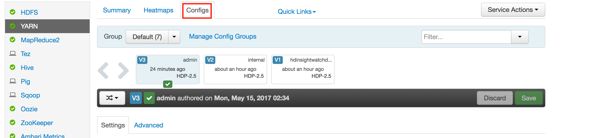
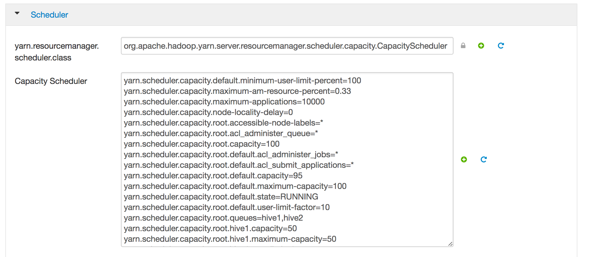
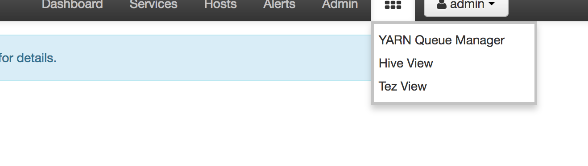

# Lab 4 - Creating YARN Queues

## ​Create and Configure YARN Capacity Scheduler Queues

Capacity Scheduler queues can be used to allocate cluster resources among users and groups. These settings can be accessed from `Ambari > YARN > Configs > Scheduler`, which provides a graphical UI to edit the configuration file: `conf/capacity-scheduler.xml`.

1. Go to Ambari UI.
2. Click on YARN in the Application bar on the left
3. Select Configs at the top:
	
4. Click `Advanced`
5. Scroll down to scheduler:
	
6. Edit with the following configurations
	`hive1`--This queue is used for short-duration queries and is assigned 50% of cluster resources.
	`hive2`--This queue is used for longer-duration queries and is assigned 50% of cluster resources.
	The following capacity-scheduler.xml settings are used to implement this configuration:

	```
	yarn.scheduler.capacity.root.queues=hive1,hive2
	yarn.scheduler.capacity.root.hive1.capacity=50
	yarn.scheduler.capacity.root.hive2.capacity=50
	```

	Configure usage limits for these queues and their users with the following settings:

	```
	yarn.scheduler.capacity.root.hive1.maximum-capacity=50
	yarn.scheduler.capacity.root.hive2.maximum-capacity=50
	yarn.scheduler.capacity.root.hive1.user-limit=1
	yarn.scheduler.capacity.root.hive2.user-limit=1
	```

7. Edit these changes and save in YARN Configs. Click confirm.
8. Restart all affected services.
	
9. Check Queues in YARN Queue Manager View:
	
10. Re-run the last labs with the following setting before each query:
	`set mapreduce.job.queuename=hive1;`

