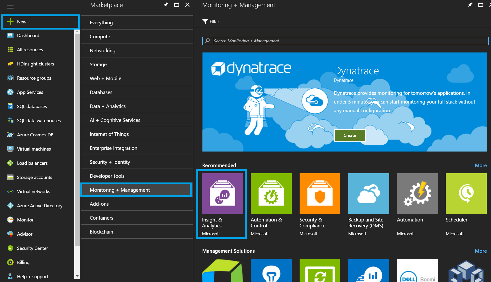
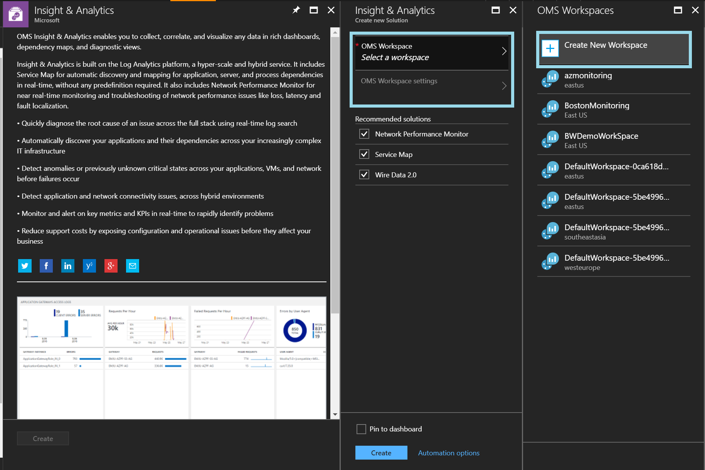
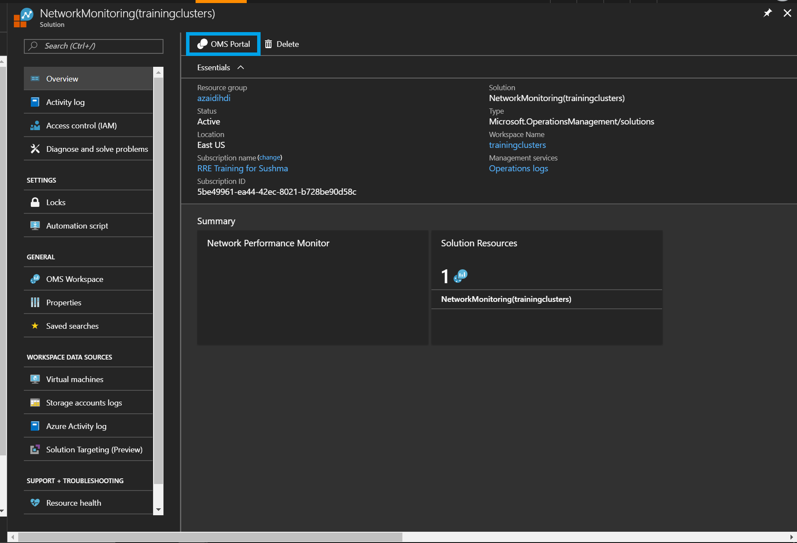
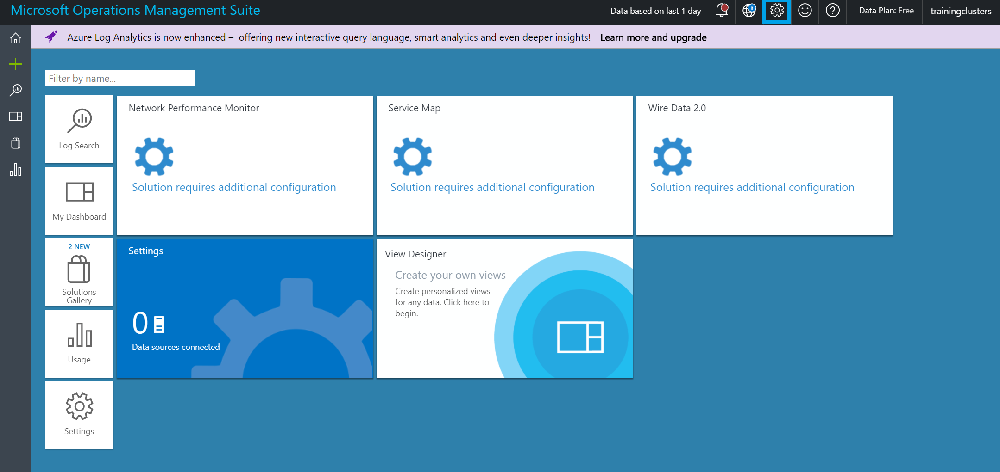
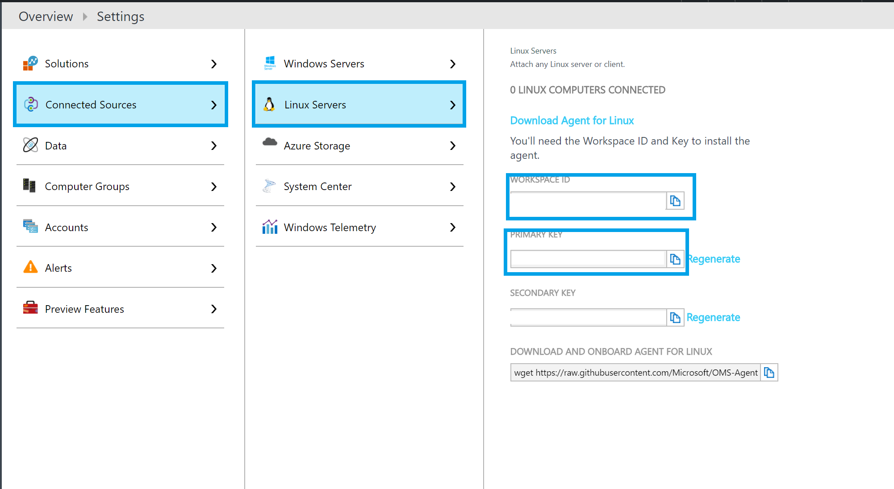
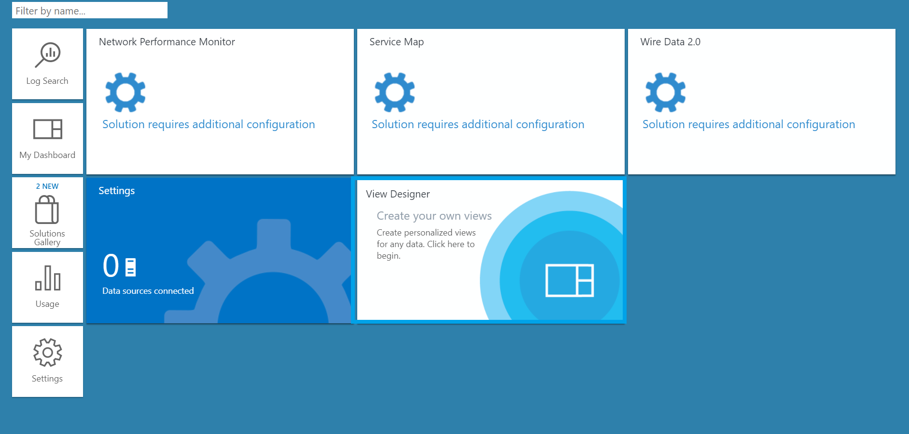
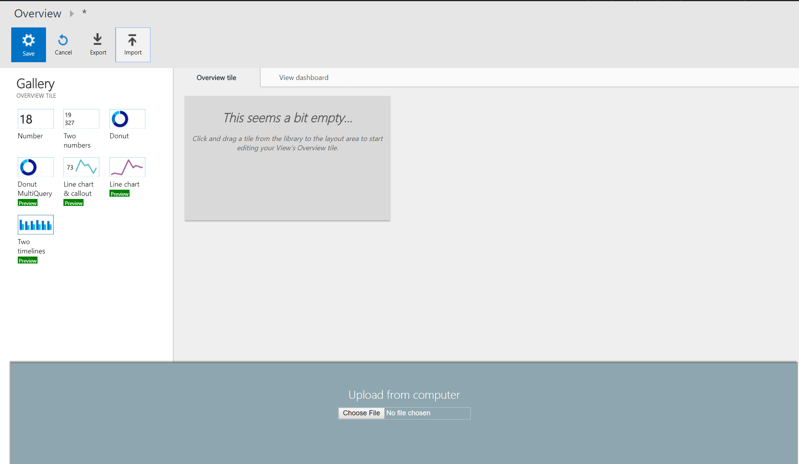

# Monitoring HDInsight Clusters wtih with Operations Management Suite (OMS)

## Links

+ [GitHub Repo with Configuration Scripts](https://github.com/hdinsight/HDInsightOMS)
+ [OMS Overview](https://docs.microsoft.com/en-us/azure/operations-management-suite/operations-management-suite-overview)

The HDInsight Monitoring solution is a management solution for Azure Log Analytics that collects important HDInsight Spark performance metrics from your HDInsight Cluster nodes and provides the tools to search the metrics, as well Spark-specific visualizations and dashboards. By using the metrics that you collect with the solution, you can create custom monitoring rules and alerts. You can monitor the metrics for multiple HDInsight clusters across multiple Azure subscriptions. 

Log Analytics is a service in [Operations Management Suite (OMS)](https://docs.microsoft.com/azure/operations-management-suite/operations-management-suite-overview) that monitors your cloud and on-premises environments to maintain their availability and performance. It collects data generated by resources in your cloud and on-premises environments and from other monitoring tools to provide analysis across multiple sources. 

[Management solutions](https://docs.microsoft.com/azure/log-analytics/log-analytics-add-solutions) add functionality to OMS, providing additional data and analysis tools to Log Analytics. Log Analytics management solutions are a collection of logic, visualization, and data acquisition rules that provide metrics pivoted around a particular area. They may also define new record types to be collected that can be analyzed with Log Searches or by additional user interface provided by the solution in the dashboard. 

[Insight & Analytics](https://azure.microsoft.com/pricing/details/insight-analytics/) is built on the underlying Log Analytics platform. You can choose to use the Log Analytics capabilities and pay per GB ingested into the service or switch your workspace to the Insight & Analytics tier and pay per node managed by the service. Insight & Analytics offers a superset of the capabilities offered under Log Analytics. The Monitoring solution is available to either Log Analytics or Insight & Analytics.

When you provision the HDInsight Monitoring solution, you will create an OMS workspace. You can think of the workspace as a unique Log Analytics environment with its own data repository, data sources, and solutions. You may create multiple workspaces in your subscription to support multiple environments such as production and test.

## Provision the HDInsight Insights and Analytics Monitoring Solution

1. Sign in to the [Azure portal](https://portal.azure.com) using your Azure subscription.
2. Within the **New** blade under **Marketplace**, select **Monitoring + management**.
3. In the **Monitoring + management** blade, click **See all**.  
4. In the listing, look for the **Insight & Analytics** band. 

      

5. In the **Insight & Analytics** blade, create a new OMS workspace and deploy:

    
6. Find your new OMS workspace and open the OMS portal:
    

### Locate OMS Workspace ID and Key

1. In the OMS portal of your workspace, click on the wrench icon for settings:
    
1. Click on Connected Sources -> Linux Servers, and copy your `Workspace ID` and `Primary Key`:
2    

## Connecting an HDInsight Spark cluster to Log Analytics

Before you can use the tools provided by the Insight & Analytics solution, you need to configure your cluster so that it transmits the metrics from its worker nodes and head nodes to Log Analytics. This is accomplished by running a Script Action against your HDInsight Spark cluster.

### Run the Script Action

To enable data collection from your HDInsight cluster, you need to run a Script Action against all the worker and head nodes in the cluster. Follow these steps to do so:

1. Navigate to the blade for your HDInsight cluster in the Azure Portal.
2. Select Script Actions.
3. Select Submit New.
4. In the Submit script action, set the Script type to "- Custom".
5. Provide a name for this script. 
6. For the Bash Script URI, paste in the following URI:

        https://raw.githubusercontent.com/hdinsight/HDInsightOMS/master/monitoring/scriptspark.sh

7. For the Node types, select all three (Head, Worker (and edge if R Server)).
8. In the Parameters text box, enter your Workspace ID and your Workspace Key, enclosing each value in quotes and separating the two quoted values with a space. 

        "WorkspaceID" "WorkspaceKey"
    For example:

        "481506d5-f04e-4901-afa6-0a688232a1c1" "bQCW1P27febK2k/S/+70jxgap2A2HTUU9V1YHE7nfW8uR31XZx3OEzJvnVNvOBo7pe+W5+ahn/my6JDtTIufcg=="
9. Select Persist this script action to rerun when new nodes are added to the cluster.
10. Select Create.
11. The Script Action will take a few minutes to run. You can monitor its status from Script Actions blade.
12. When the Script Action completes, you should see a green checkmark next to the script name in the listing. 

## Log Analytics and Spark View

1. You can now navigate to your OMS workspace and monitor your cluster
1. To import the Spark View, click on _View Designer_ tile:
    
1. Click on import:
    
1. Upload the file [learnAnalytics-HDI-Hero/Student-Resources/Labs/Lab-3-Using-OMS/sparkOMS.omsview](https://github.com/Azure/learnAnalytics-HDI-Hero/blob/relab/Student-Resources/Labs/Lab-3-Using-OMS/sparkOMS.omsview) from the repo and click save.